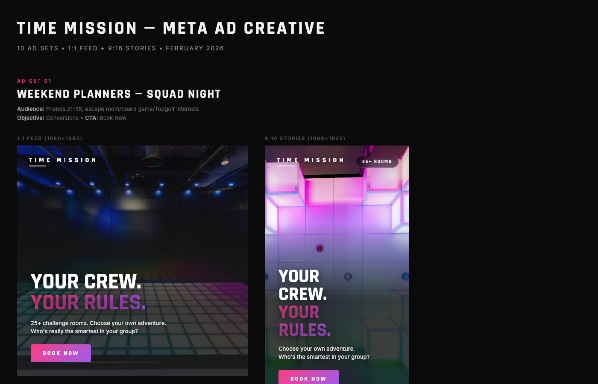

# Time Mission — Meta Ad Creative (Feb 2026)

10 ad sets (20 total ads) for Time Mission social media campaigns on Meta (Facebook/Instagram).

## What's Inside

- **`ads-all.html`** — All 20 ads rendered as pixel-perfect HTML at exact ad dimensions
- **Preview screenshots** — PNG renders of all ads for quick viewing

## Ad Sets

| # | Ad Set | Target Audience | Format | Color System |
|---|--------|----------------|--------|-------------|
| 1 | Squad Night | Friends 21-38 | 1:1 + 9:16 | Super Purple |
| 2 | Date Night | Couples 21-40 | 1:1 + 9:16 | Sonic Orange |
| 3 | Family Game Night | Parents 30-50 | 1:1 + 9:16 | Super Purple |
| 4 | Spring Break | Parents (seasonal) | 1:1 + 9:16 | Speed Blue |
| 5 | Corporate Team Build | Managers/HR 28-55 | 1:1 + 9:16 | Speed Blue |
| 6 | Birthday Party | Celebration planners 21-45 | 1:1 + 9:16 | Super Purple |
| 7 | Think You're Smart | Thrill seekers 18-35 | 1:1 + 9:16 | Sonic Orange |
| 8 | Something New | Novelty seekers 18-35 | 1:1 + 9:16 | Super Purple |
| 9 | Social Proof (Retargeting) | Site visitors / video viewers | 1:1 + 9:16 | Black + Orange CTA |
| 10 | Broad Awareness | Advantage+ 18-55 | 1:1 + 9:16 | Super Purple |

## Brand System

Built to the **Time Mission 2026 Rebrand** guidelines:

- **Mission Black** `#1C1C1C`
- **Time White** `#F3F1EE`
- **Super Purple** `#FE3D82` → `#9D5CED`
- **Sonic Orange** `#F9A41A` → `#EF4B23`
- **Speed Blue** `#1F4ABA` → `#028BBF`

## Preview

## Note

The HTML file references local venue photos from the Time Mission Dropbox. Background images won't load without those local files — use the PNG screenshots to see the full rendered ads, or replace image paths with hosted URLs.

---

*Generated with Claude Code — Feb 27, 2026*
